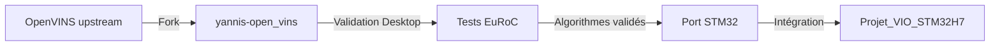

# Intégration OpenVINS → STM32H7

##  Objectif

Ce fork OpenVINS sert de **plateforme de validation** pour le projet embarqué STM32H7.

## 🔗 Repos liés

- **Ce repo** : `Yannisloum63/yannis-open_vins` (fork OpenVINS, validation desktop)
- **Repo principal** : `[VOTRE_ORGANISATION]/Projet_VIO_STM32H7` (firmware embarqué)

##  Workflow de développement



## 🛠️ Portage vers STM32

### Modules à porter

| Module OpenVINS | Adaptation STM32 | Priorité |
|-----------------|------------------|----------|
| `ov_core::ImuData` | ✅ Direct (structure simple) | P0 |
| `ov_core::CameraData` | ⚠️ Réduire résolution (320x240) | P0 |
| `ov_init::DynamicInitializer` | ✅ Port ESKF | P0 |
| `ov_msckf::StateHelper` | ✅ Matrices Eigen adaptées | P1 |
| `trackFEATS` (KLT) | ⚠️ Remplacer par ORB-SLAM lite | P1 |
| `updaterMSCKF` | ✅ Covariance update | P2 |

### Contraintes STM32H7

- **RAM** : 1 MB SRAM (vs. 8+ GB desktop) → Limiter sliding window à 5-7 clones
- **Flash** : 2 MB (vs. illimité) → Pas de dépendances Boost, OpenCV minimal
- **CPU** : 480 MHz ARM (vs. 3+ GHz x86) → Optimiser matrices creuses
- **Pas de FPU double** : Convertir `double` → `float` partout

### Bibliothèques embarquées

| Desktop | STM32 Embedded |
|---------|----------------|
| Eigen 3.4 | Eigen 3.3 (sans BLAS) |
| OpenCV 4.6 | OpenMV ou custom (features only) |
| Boost | ❌ Supprimer (remplacer par std::chrono) |
| ROS/ROS2 | ❌ N/A (bare metal) |

##  Fichiers à extraire

Pour le portage, copier **uniquement** :

```bash
# Depuis yannis-open_vins vers Projet_VIO_STM32H7/firmware/external/openvins_lite/

# Headers essentiels
ov_core/src/types/
ov_core/src/utils/quat_ops.h
ov_core/src/utils/print.h (adapter sans cout)

# Initialisation
ov_init/src/static/
ov_init/src/dynamic/ (ESKF principal)

# État et propagation
ov_msckf/src/state/State.h
ov_msckf/src/state/StateHelper.h
ov_msckf/src/state/Propagator.h

# Configuration
config/euroc_mav/kalibr_imu_chain.yaml → imu_config/
```

**Ne PAS copier** :
- `ov_msckf/src/ros/` (tout ROS)
- `examples/` (desktop uniquement)
- `docs/` (générée par Doxygen)
- Fichiers de build `build/`, `devel/`

##  Validation avec ce repo

### Tests Desktop (ici)

```bash
cd ~/workspace/open_vins/examples_integration/build
./euroc_reader_example ~/datasets/mav0/ ../../config/euroc_mav/estimator_config.yaml
# RMSE actuel : 8.6 cm (excellent)
```

### Objectifs STM32

- **RMSE cible** : < 20 cm (acceptable pour cas d'usage industriel)
- **Fréquence IMU** : 200 Hz (identique)
- **Fréquence caméra** : 10 Hz (réduite de 20 Hz → économie CPU)
- **Latence** : < 50 ms (temps réel)

##  Checklist d'intégration

- [ ] Valider algorithme sur desktop (ce repo)
- [ ] Identifier modules critiques
- [ ] Adapter types `double` → `float`
- [ ] Remplacer Boost par code custom
- [ ] Porter Eigen avec `-DEIGEN_NO_DEBUG`
- [ ] Implémenter buffer circulaire IMU (remplace `std::deque`)
- [ ] Tester sur cible STM32H7
- [ ] Profiler CPU/RAM
- [ ] Optimiser matrices creuses

##  Documentation

- [Architecture VIO](../docs/vio_fusion.md) - Algorithme ESKF complet
- [System Overview](../docs/system_overview.md) - Vue d'ensemble matériel
- [Session Summary](SESSION_SUMMARY.md) - Résultats validation EuRoC

##  Synchronisation

**Workflow** : Les modifications validées ici (algorithme, calibration) sont **manuellement portées** vers le repo STM32, pas via Git submodule.

**Raison** : Le code embarqué nécessite des adaptations importantes (float vs double, pas de stdlib complète, contraintes mémoire) → copie intelligente > lien automatique.

---
