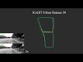

# OpenVINS


Welcome to the OpenVINS project!
The OpenVINS project houses some core computer vision code along with a state-of-the art filter-based visual-inertial estimator.
The core filter is an [Extended Kalman filter](https://en.wikipedia.org/wiki/Extended_Kalman_filter) which fuses inertial information with sparse visual feature tracks.
These visual feature tracks are fused leveraging the [Multi-State Constraint Kalman Filter (MSCKF)](https://ieeexplore.ieee.org/document/4209642) sliding window formulation which allows for 3D features to update the state estimate without directly estimating the feature states in the filter.
Inspired by graph-based optimization systems, the included filter has modularity allowing for convenient covariance management with a proper type-based state system.
Please take a look at the feature list below for full details on what the system supports.


* Github project page - https://github.com/rpng/open_vins
* Documentation - https://docs.openvins.com/
* Getting started guide - https://docs.openvins.com/getting-started.html
* Publication reference - http://udel.edu/~pgeneva/downloads/papers/c10.pdf


## News / Events

* **January 21, 2020** - Our paper has been accepted for presentation in [ICRA 2020](https://www.icra2020.org/). We look forward to seeing everybody there! We have also added links to a few videos of the system running on different datasets.
* **October 23, 2019** - OpenVINS placed first in the [IROS 2019 FPV Drone Racing VIO Competition
](http://rpg.ifi.uzh.ch/uzh-fpv.html). We will be giving a short presentation at the [workshop](https://wp.nyu.edu/workshopiros2019mav/) at 12:45pm in Macau on November 8th.
* **October 1, 2019** - We will be presenting at the [Visual-Inertial Navigation: Challenges and Applications
](http://udel.edu/~ghuang/iros19-vins-workshop/index.html) workshop at [IROS 2019](https://www.iros2019.org/). The submitted workshop paper can be found at [this](http://udel.edu/~ghuang/iros19-vins-workshop/papers/06.pdf) link.
* **August 21, 2019** - Open sourced [ov_maplab](https://github.com/rpng/ov_maplab) for interfacing OpenVINS with the [maplab](https://github.com/ethz-asl/maplab) library.
* **August 15, 2019** - Initial release of OpenVINS repository and documentation website! 


## Project Features


* Sliding window visual-inertial MSCKF
* Modular covariance type system
* Comprehensive documentation and derivations
* Extendable visual-inertial simulator
    * On manifold SE(3) b-spline
    * Arbitrary number of cameras
    * Arbitrary sensor rate
    * Automatic feature generation
* Five different feature representations
    1. Global XYZ
    2. Global inverse depth
    3. Anchored XYZ
    4. Anchored inverse depth
    5. Anchored MSCKF inverse depth
* Calibration of sensor intrinsics and extrinsics
    * Camera to IMU transform 
    * Camera to IMU time offset
    * Camera intrinsics
* Environmental SLAM feature
    * OpenCV ARUCO tag SLAM features
    * Sparse feature SLAM features
* Visual tracking support
    * Monocular camera
    * Stereo camera
    * Binocular camera
    * KLT or descriptor based
* Static IMU initialization (sfm will be open sourced later)
* Out of the box evaluation on EurocMav and TUM-VI datasets
* Extensive evaluation suite (ATE, RPE, NEES, RMSE, etc..)

## Demo Videos


[](http://www.youtube.com/watch?v=KCX51GvYGss "OpenVINS - EuRoC MAV Vicon Rooms Flyby")
[](http://www.youtube.com/watch?v=Lc7VQHngSuQ "OpenVINS - TUM VI Datasets Flyby")
[](http://www.youtube.com/watch?v=vaia7iPaRW8 "OpenVINS - UZH-FPV Drone Racing Dataset Flyby")
[](http://www.youtube.com/watch?v=MCzTF9ye2zw "OpenVINS - KAIST Urban 39 Dataset Demonstration")

[](http://www.youtube.com/watch?v=187AXuuGNNw "OpenVINS - EuRoC MAV Vicon Rooms Demonstration")
[](http://www.youtube.com/watch?v=oUoLlrFryk0 "OpenVINS - TUM VI Datasets Demostration")
[](http://www.youtube.com/watch?v=ExPIGwORm4E "OpenVINS - UZH-FPV Drone Racing Dataset Demonstration")


## Credit / Licensing

This code was written by the [Robot Perception and Navigation Group (RPNG)](https://sites.udel.edu/robot/) at the University of Delaware.
If you have any issues with the code please open an issue on our github page with relevant implementation details and references.
For researchers that have leveraged or compared to this work, please cite the following:
```txt
@Conference{Geneva2020ICRA,
  Title      = {OpenVINS: A Research Platform for Visual-Inertial Estimation},
  Author     = {Patrick Geneva and Kevin Eckenhoff and Woosik Lee and Yulin Yang and Guoquan Huang},
  Booktitle  = {Proc. of the IEEE International Conference on Robotics and Automation},
  Year       = {2020},
  Address    = {Paris, France},
  Url        = {\url{https://github.com/rpng/open_vins}}
}
```


The codebase is licensed under the [GNU General Public License v3 (GPL-3)](https://www.gnu.org/licenses/gpl-3.0.txt).


